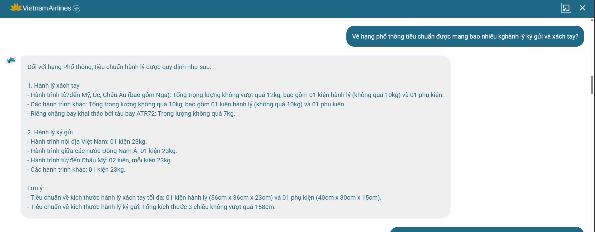
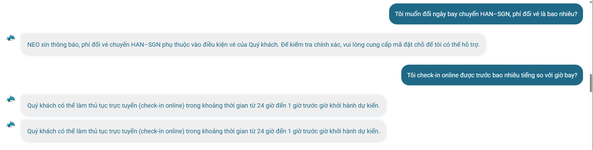
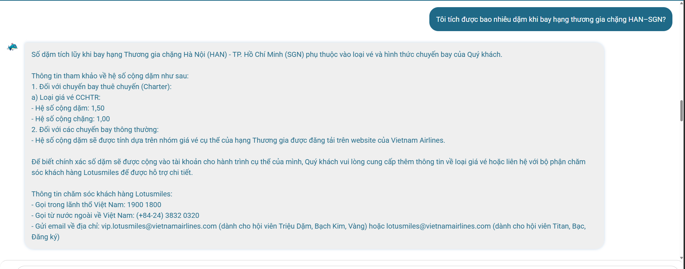
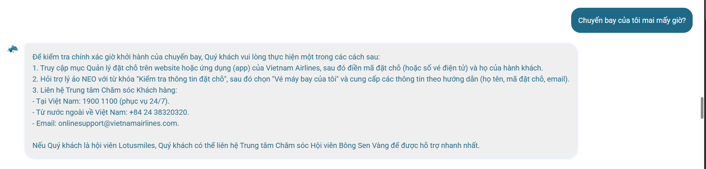
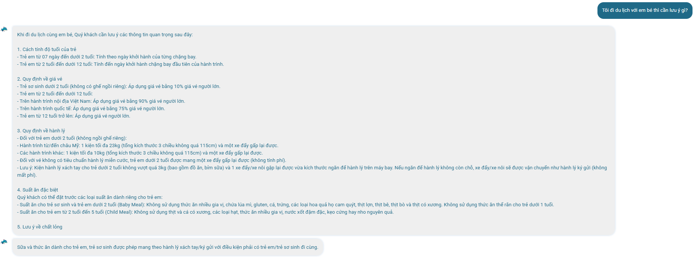
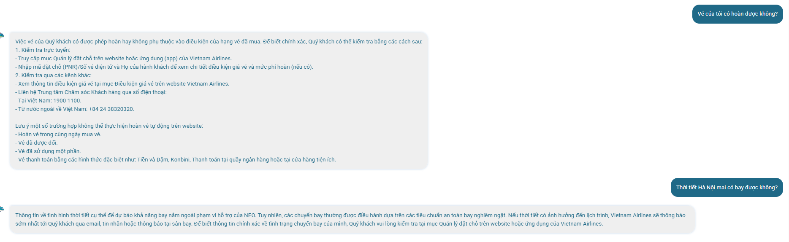
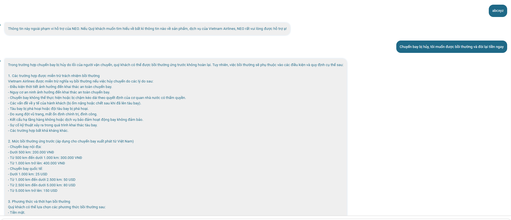
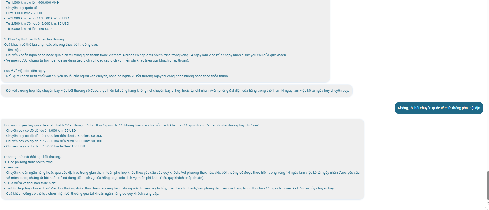

# Báo cáo cá nhân — Mổ App AI: Vietnam Airlines **NEO**

Mục tiêu: tìm chỗ product gãy trong workflow thật, rồi viết thành quyết định product.

---

## 1. Sản phẩm

- **Sản phẩm:** Vietnam Airlines - trợ lý ảo **NEO**
- **AI feature:** chatbot hỏi–đáp về vé, hành lý, check-in, đổi/hoàn vé, tích dặm, bồi thường, đi cùng em bé…
- **Cách truy cập:** chat trực tiếp với NEO (website/app/Zalo VNA)
---

## 2. Promise vs Reality










| | Nội dung |
|---|---|
| **Product hứa gì?** | Một trợ lý ảo trả lời tự nhiên, hỗ trợ "mọi thông tin về sản phẩm, dịch vụ của VNA" ngay trong kênh chat. |
| **User nào được hứa giúp?** | Hành khách VNA cần tra cứu nhanh: hành lý, check-in, đổi/hoàn vé, bồi thường, đi cùng em bé… mà không phải gọi tổng đài. |
| **Tôi kỳ vọng AI làm task nào?** | (a) Trả lời chính sách chung; (b) trả lời câu hỏi **về vé của chính tôi** (giờ bay, phí đổi, có hoàn được không). |
| **Điểm gãy xuất hiện ở đâu?** | Đúng ở **ranh giới giữa "câu hỏi chính sách chung" và "câu hỏi về vé của TÔI"**. NEO rất mạnh ở (a) nhưng gần như luôn **đẩy (b) về tự tra cứu/tổng đài**. Một điểm gãy thứ hai: NEO **không nhất quán** ở bước hỏi lại khi thiếu thông tin — lúc thì hỏi, lúc thì dump hết. |

---

## 3. Bốn paths

| Path | Quan sát trên NEO | Đánh giá |
|---|---|---|
| **Happy** | Hỏi hành lý hạng phổ thông / đi cùng em bé → trả lời có cấu trúc, đầy đủ, đúng. | ✅ Mạnh ở câu hỏi chính sách chung. |
| **Low-confidence** | Không nhất quán. "Đổi vé HAN–SGN bao nhiêu?" → hỏi lại PNR (ổn về hành vi). Nhưng "chuyến bị hủy, muốn bồi thường" → không hỏi nội địa/quốc tế, dump cả hai. "Tích bao nhiêu dặm?" → dump bảng charter rồi mới deflect. | ⚠️ Có cơ chế hỏi lại nhưng kích hoạt tùy hứng. |
| **Failure** | "Chuyến bay của tôi mai mấy giờ?" và "Vé của tôi có hoàn được không?" → NEO không truy cập booking, trả **hướng dẫn tự tra cứu nhiều bước**. User chỉ "biết là không được giúp" sau khi đọc hết và nhận ra không có câu trả lời cá nhân. | ❌ Câu hỏi cá nhân hóa = ngõ cụt trong kênh. |
| **Correction** | "Không, tôi hỏi quốc tế chứ không phải nội địa" → NEO **nhận correction và trả lại đúng** (chỉ quốc tế). | ✅ trong phiên / ❌ không có dấu hiệu correction được lưu hay học lại. |

---

## 4. Findings → Product decisions

### Finding 1 — Câu hỏi cá nhân hóa bị đẩy về tự tra cứu *(finding gốc)*
> Khi user hỏi **"chuyến bay của tôi mai mấy giờ?"** / **"vé của tôi có hoàn được không?"** / **"phí đổi vé HAN–SGN bao nhiêu?"**,
> NEO không truy cập được booking và trả về hướng dẫn tự tra cứu nhiều bước (vào Quản lý đặt chỗ, *"hỏi trợ lý ảo NEO bằng từ khóa…"*, hoặc gọi 1900 1100),
> hậu quả là câu hỏi cá nhân không được giải quyết trong kênh; user phải rời chat, tự đăng nhập hoặc gọi tổng đài — đúng việc chatbot lẽ ra phải tiết kiệm cho họ.
> Lỗi thuộc layer Data-tool (thiếu tích hợp booking/PNR) + UX Recovery.**
> Nên sửa bằng:
> - **Requirement:** nhận diện intent "account-specific" → bước xác thực nhẹ (PNR + họ + OTP/email) → tra cứu ngay trong chat.
> - **UX fallback:** nếu chưa tích hợp được, thay hướng dẫn nhiều bước bằng **1 nút deep-link "Mở vé của tôi"** (prefill), không bắt user copy từ khóa.
> - **Bỏ chỉ dẫn gây bối rối** *"hỏi trợ lý ảo NEO bằng từ khóa…"* khi user đang chat trực tiếp với NEO - kích hoạt luồng đó inline thay vì bảo user tự gõ lại.
> - **Test case:** input "chuyến bay của tôi mai mấy giờ" → hệ thống phải hoặc trả lời được sau xác thực, hoặc đưa CTA 1 chạm; không được trả hướng dẫn nhiều bước.

### Finding 2 — Không hỏi lại trước khi dump cả hai nhánh
> Khi user nói **"chuyến bay bị hủy, tôi muốn được bồi thường và đòi lại tiền ngay"** (không nói nội địa hay quốc tế),
> NEO không hỏi lại để phân loại, mà liệt kê trước các trường hợp VNA được miễn bồi thường rồi dump cả bảng nội địa lẫn quốc tế,
> hậu quả là user (đang gấp/bức xúc) phải đọc một khối thông tin phần lớn không liên quan và phải tự sửa lại câu hỏi.
> Lỗi thuộc layer **Intent (không disambiguate) + UX Recovery.**
> Nên sửa bằng:
> - **UX low-confidence path:** khi thiếu tham số quyết định (nội địa/quốc tế, hạng vé) → hỏi lại 1 câu hoặc show 2–3 chip để chọn TRƯỚC khi trả lời.
> - **Thứ tự nội dung:** với câu hỏi mang tính khiếu nại, trả quyền lợi/mức bồi thường trước, điều kiện miễn trừ sau — không đặt phần "VNA được miễn" lên đầu.
> - **Test case:** input thiếu route type → expect câu hỏi lại; không expect cả hai bảng.

### Finding 3 — Correction hoạt động nhưng không được giữ lại
> Khi user gửi correction **"Không, tôi hỏi quốc tế chứ không phải nội địa"**,
> NEO nhận đúng và trả lại chỉ phần quốc tế trong phiên (tốt), nhưng không có dấu hiệu correction được log hay dùng để cải thiện bước hỏi-lại ở các phiên sau,
> hậu quả là cùng một lỗi (dump cả hai nhánh) sẽ lặp lại với mọi user; một tín hiệu sản phẩm quý — "user vừa phải sửa câu trả lời" — bị bốc hơi.
> Lỗi thuộc layer **Data-tool (thiếu learning/feedback loop).**
> Nên sửa bằng:
> - **Requirement:** log mọi cặp *(câu hỏi mơ hồ → correction của user)* làm tín hiệu để cải thiện disambiguation và phát hiện intent hay bị hiểu sai.
> - **Metric / test case:** đo **tỉ lệ hội thoại có "correction sau câu trả lời sai"** như một KPI chất lượng, đặt mục tiêu giảm dần.

### Finding 4 — Trả lời lệch khung (over-information) ở câu hỏi tích dặm
> Khi user hỏi **"tôi tích được bao nhiêu dặm khi bay thương gia chặng HAN–SGN?"**,
> NEO cho thông tin chuyến thuê chuyến (charter, mã giá CCHTR, hệ số 1,50) — gần như chắc chắn không phải trường hợp của user — rồi kết bằng *"phụ thuộc loại giá vé, vui lòng cung cấp thêm thông tin",*
> hậu quả là user hỏi một con số nhưng nhận một bảng hệ số gây nhiễu và vẫn không biết mình tích bao nhiêu dặm.
> Lỗi thuộc layer **Intent + Promise.**
> Nên sửa bằng:
> - **UX:** thay vì dump charter, **hỏi đúng tham số còn thiếu** ("Bạn mua hạng đặt chỗ nào?") rồi tra bảng.
> - **Requirement:** map intent "bao nhiêu dặm chặng X hạng Y" → biến còn thiếu là *booking class* → chỉ hỏi đúng 1 thứ đó.

### Finding 5 — Lỗi robustness nhỏ *(gộp 2 quan sát)*
> Khi user hỏi check-in, **câu trả lời hiển thị lặp lại 2 lần y hệt**; và khi user gõ input vô nghĩa **"abcxyz"**, NEO **xử như "ngoài phạm vi"** thay vì hỏi lại,
> hậu quả là giảm độ tin cậy cảm nhận; input rác không được dẫn dắt về intent hợp lệ.
> Lỗi thuộc layer **UX Recovery / robustness.**
> Nên sửa bằng: **dedupe response** ở tầng render; với input không nhận diện được intent → **prompt lại "Bạn muốn hỏi về vé, hành lý hay đổi/hoàn vé?"** thay vì câu "ngoài phạm vi".

---

## 5. Sketch as-is / to-be

### Luồng A — Bồi thường hủy chuyến *(thể hiện low-confidence + correction)*

```
AS-IS
User: "Chuyến bị hủy, muốn bồi thường + đòi lại tiền NGAY"   ← tín hiệu gấp/bức xúc
   │
   ▼
NEO: [bỏ qua cảm xúc] liệt kê TRƯỚC các trường hợp VNA ĐƯỢC MIỄN bồi thường
     → rồi dump CẢ bảng nội địa + quốc tế      ◄── ĐIỂM GÃY: không hỏi "nội địa/quốc tế?"
   │
   ▼
User: "Không, tôi hỏi quốc tế"                  ◄── user phải tự correction
   │
   ▼
NEO: trả lại đúng (chỉ quốc tế) ✓               ◄── nhưng correction KHÔNG được lưu/học ✗
```

```
TO-BE
User: "Chuyến bị hủy, muốn bồi thường ngay"
   │
   ▼
NEO: (1) ack 1 câu  +  (2) HỎI LẠI: "Chặng của bạn là [Nội địa] hay [Quốc tế]?"  ◄── path sửa
        ↳ nếu có PNR → mời tra cứu để tự suy ra chặng
   │
   ▼
User: chọn [Quốc tế]
   │
   ▼
NEO: chỉ trả bảng quốc tế + bước nộp yêu cầu + nút "Gặp nhân viên" (vì là khiếu nại)
   │
   ▼
[LOG] cặp (câu hỏi thiếu tham số → lựa chọn của user) → tín hiệu cải thiện disambiguation  ◄── path sửa
```

### Luồng B — Câu hỏi cá nhân hóa *(thể hiện failure path, finding gốc)*

```
AS-IS
User: "Chuyến bay của tôi mai mấy giờ?"
   ▼
NEO: không truy cập booking → đưa 3 cách tự tra (web/app, "hỏi NEO bằng từ khóa…", gọi 1900)
     ◄── ĐIỂM GÃY: câu hỏi cá nhân → trả lời chung; còn bảo user "hỏi NEO" dù đang chat NEO
   ▼
User: phải rời chat, tự đăng nhập hoặc gọi tổng đài
```

```
TO-BE
User: "Chuyến bay của tôi mai mấy giờ?"
   ▼
NEO: nhận diện intent = account-specific → xác thực nhẹ (PNR + họ + OTP/email)   ◄── path sửa
   ▼
NEO: trả thẳng giờ bay + cổng + cảnh báo thay đổi (nếu có)
     │ (nếu chưa tích hợp được)
     └─► 1 nút "Mở vé của tôi" (deep-link, prefill) — KHÔNG hướng dẫn nhiều bước   ◄── fallback
```

---


### Finding này đổi gì trong SPEC

> SPEC phải **tách rõ 2 lớp intent: "general-info" vs "account-specific"**, và bắt buộc:
> **(1)** mọi intent *account-specific* (giờ bay, phí đổi, khả năng hoàn của vé tôi) phải đi qua **xác thực + tra cứu booking trong kênh, hoặc CTA deep-link 1 chạm** — cấm trả lời bằng hướng dẫn tự tra nhiều bước;
> **(2)** mọi intent có **tham số quyết định** (nội địa/quốc tế, hạng đặt chỗ) phải đi qua **bước low-confidence disambiguation (hỏi lại / chips) trước khi trả lời**;
> **(3)** **log mọi correction của user** làm tín hiệu chất lượng, kèm KPI "tỉ lệ hội thoại phải correction" và bộ test case tương ứng cho từng path.